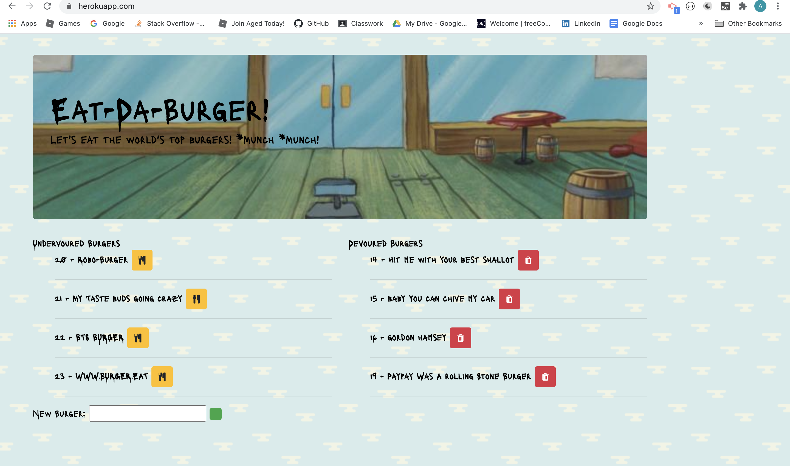

# burger
## Welcome to front-end and back end website.
Purpose of this assigment is to run and connect both back end and front end using handlebars.
live website (https://nameless-sierra-39712.herokuapp.com/)

#How to use Burger app
1. There are couple of burgers on undevoured and devoured tables.
2. Under undevoured table burgers can be clicked on button and moved to devoured table.
3. Under devoured table you can delete the burgers.
4. You can add you own burger to undervaoured table and then later move to devoured.
5. All the data is run on MySql workbench.

#Technologies used
Javascript--Node.js--Ajax--j.Query--HTML/CSS--Bootstrap--MySQL--Handlebars--NPM Packages

##Contributor
Aida Yrysbekova
